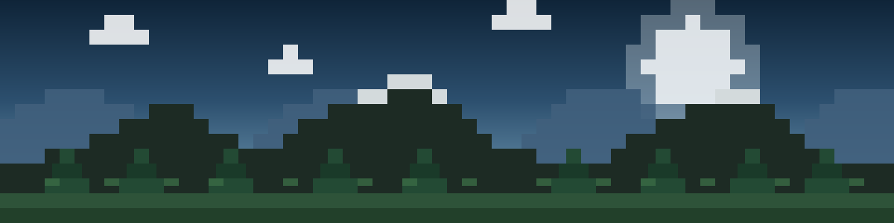

<div align="center">

<!-- ============ BANNER (ilustrasi pixel art original) ============ -->


<br/>

<!-- ============ TYPING ANIMATION ============ -->
<!-- Ganti &lines= untuk mengubah kalimat yang muncul bergantian -->
<a href="https://github.com/Alvalah22">
  
</a>

<br/>

<!-- ============ SOCIAL BADGES ============ -->
<!-- ganti: sesuaikan username/link tiap platform -->
<a href="https://github.com/Alvalah22">
  
</a>
<a href="https://www.linkedin.com/in/dava-fajar-alvalah-861298393/"> <!-- ganti: link LinkedIn asli -->
  
</a>
<a href="https://www.instagram.com/dava_f_a?igsh=MXNycHA4bWM3MWo0eQ=="> <!-- ganti: link Instagram asli -->
  
</a>
<a href="https://discord.com/users/1217122597536399511"> <!-- ganti: username/invite Discord asli -->
  
</a>

</div>

<br/>

<!-- ============ ABOUT ME ============ -->
## 🗻 About Me

```yaml
name: "Alvalah22"
role: "Computer Science Student"
focus: ["Software Development", "Web Development", "Cyber Security", "Artificial Intelligence"]
currently: "Memperdalam fundamental Data Structure & Algorithm sambil membangun project nyata"
goal: "Menjadi Software Engineer yang juga paham keamanan sistem dan AI"
fun_fact: "Sering coding sambil mikirin cara paling efisien nge-build rumah di Minecraft — logikanya ternyata mirip nyusun clean code 🧱"
```

Saya adalah mahasiswa **Computer Science** yang sedang membangun fondasi kuat di dunia software development. Ketertarikan saya cukup luas — mulai dari membangun aplikasi web, memahami sisi keamanan sistem (*cyber security*), sampai eksplorasi awal di bidang *artificial intelligence*. Saya percaya bahwa belajar terbaik datang dari membangun project nyata, bukan hanya teori.

Di luar layar terminal, saya menikmati ketenangan alam dan dunia pixel — dua hal yang menurut saya sama-sama mengajarkan tentang membangun sesuatu blok demi blok, dengan sabar dan terstruktur.

<br/>

<!-- ============ CURRENTLY LEARNING ============ -->
## 🧭 Currently Learning

<div align="center">


</div>

<br/>

<!-- ============ TECH STACK ============ -->
## 🧰 Tech Stack

**Programming Languages**


<!-- ganti/tambah: bahasa lain yang kamu kuasai, mis. Java, C++ -->

**Frontend Development**


**Tools**


<!-- ganti/tambah: tools lain, mis. Docker, Wireshark, Burp Suite -->

**Operating System**


**Version Control**


<br/>

<!-- ============ GITHUB STATS ============ -->
## 📊 GitHub Analytics

<div align="center">


</div>

<!-- ============ CONTRIBUTION SNAKE ============ -->
<!--
  Animasi snake ini digenerate otomatis oleh workflow di .github/workflows/snake.yml
  Setelah workflow berjalan pertama kali, GitHub akan membuat branch "output" berisi file svg-nya.
-->
<div align="center">
  
</div>

<br/>

<!-- ============ WAKATIME ============ -->
<!--
  Butuh setup tambahan agar terisi:
  1. Buat akun di wakatime.com dan install plugin di code editor kamu
  2. Tambahkan WAKATIME_API_KEY sebagai repo secret
  3. Tambahkan workflow "waka-readme" (mis. dari action athul/waka-readme) yang menulis
     hasilnya di antara komentar START/END di bawah ini
-->
## ⏱️ Weekly Coding Activity (WakaTime)

<!--START_SECTION:waka-->
```text
Belum ada data — akan otomatis terisi setelah workflow WakaTime pertama kali berjalan.
```
<!--END_SECTION:waka-->

<br/>

<!-- ============ FEATURED PROJECTS ============ -->
## 🚀 Featured Projects

<div align="center">

<a href="https://github.com/Alvalah22/digital_clock"> <!-- ganti: link repo asli -->
  
</a>
<a href="https://github.com/Alvalah22/live-meme-detector.git"> <!-- ganti: link repo asli -->
  
</a>

<a href="https://github.com/Alvalah22/Alvalah22.github.io"> <!-- ganti: link repo asli -->
  
</a>
<a href="https://github.com/Alvalah22/cyber-security-tools"> <!-- ganti: link repo asli -->
  
</a>

</div>

> Pin card di atas otomatis menampilkan bintang & bahasa repo — pastikan nama repo di URL sama persis dengan nama repo asli di akunmu.

<br/>

<!-- ============ VISITOR COUNTER ============ -->
<div align="center">


</div>

<br/>

<!-- ============ QUOTE ============ -->
<div align="center">

### *"Think with Logic. Build with Code. Lead the Change."*

</div>

<br/>

<!-- ============ FOOTER ============ -->
<div align="center">
  <sub>Thanks for visiting. See you in the next commit.</sub>
</div>
